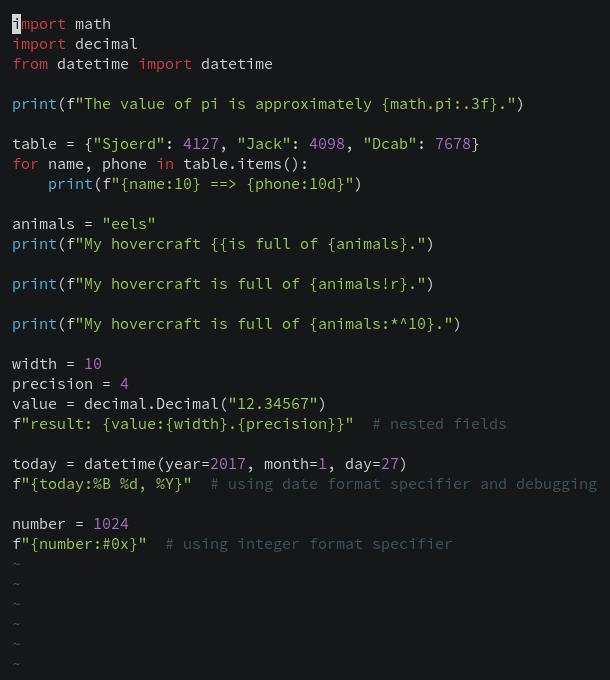

**UPDATE 2020-10-30**: First iteration of this post was very naive, supporting
only the very basic. See the
[diff](https://gist.github.com/phelipetls/8726d6cd68e66ad6b83586ae53f3b3d8/revisions#diff-8108a43d0db89a371349e6de001c6932fba065485f6790dddd5b011e7ae7f527)
that adds support for string modifiers and escape sequences.

Getting Python syntax highlighting to work in Vim requires very little code, to
my surprise.

 

Here is everything that you need and an explanation below.

```vim
" in ~/.config/nvim/after/syntax or ~/.vim/after/syntax
syn match pythonEscape +{{+ contained containedin=pythonfString,pythonfDocstring
syn match pythonEscape +}}+ contained containedin=pythonfString,pythonfDocstring

syn region pythonfString matchgroup=pythonQuotes
      \ start=+[fF]\@1<=\z(['"]\)+ end="\z1"
      \ contains=@Spell,pythonEscape,pythonInterpolation
syn region pythonfDocstring matchgroup=pythonQuotes
      \ start=+[fF]\@1<=\z('''\|"""\)+ end="\z1" keepend
      \ contains=@Spell,pythonEscape,pythonSpaceError,pythonInterpolation,pythonDoctest

syn region pythonInterpolation contained
      \ matchgroup=SpecialChar
      \ start=+{{\@!+ end=+}}\@!+ skip=+{{+ keepend
      \ contains=ALLBUT,pythonDecoratorName,pythonDecorator,pythonFunction,pythonDoctestValue,pythonDoctest

syn match pythonStringModifier /:\(.[<^=>]\)\?[-+ ]\?#\?0\?[0-9]*[_,]\?\(\.[0-9]*\)\?[bcdeEfFgGnosxX%]\?/ contained containedin=pythonInterpolation
syn match pythonStringModifier /![sra]/ contained containedin=pythonInterpolation

hi link pythonfString String
hi link pythonfDocstring String
hi link pythonStringModifier PreProc
```

# Declaring a syntax region for f-strings

The first two lines define a new syntax region (see `:h syn-region`) called
`pythonfString`.

We then declare how it starts with the regex `[fF]\@1<=\z(['"]\)`, which is
equivalent to `(?:<=[fF])(['"])` in Perl regular expressions (see `:h \@<=`).
The second line just handles the case of a docstring.

The string will end how it starts, so we can just reference the captured group
using `\z1` (we need to prefix it with `z` because it is an external pattern,
see `:h \z(`).

The `matchgroup` argument tells Vim which highlight group it should use to
highlight the start/end pattern. The group `pythonQuotes` come from the default
syntax file.

# Handling expressions inside f-strings

We also need to declare what this region contains.

For this we declare another region called `pythonInterpolation`, which starts
with "{" (but not with "{{", which will actually produce a literal "{") and
closes with "}". With that in mind, we use the regex `{{\@!` because we don't
want a match if the preceding token is present (see `:h \@!`).

This region may contain only expressions, so stuff like a function declaration
does not make sense (notice there is a syntax for that, `:helpgrep ALLBUT`)

# Handling string modifiers

f-strings supports
[`str.format` syntax](https://docs.python.org/3/library/string.html#format-examples)
for formatting, for example:

```python
import math
print(f"The value of pi is approximately {math.pi:.3f}.")
```

So I read the
[Python docs](https://docs.python.org/3/library/string.html#format-specification-mini-language)
and wrote a regex based on it, but regexes are always easier to write than to
read so I wouldn't recommend you trying.

It's also possible to convert a value as if wrapping them in functions such as
`ascii()`, `repr()`, `str()` with `!a`, `!r`, `!s` respectively, so we need to
handle this also.

For this, I declared a syntax group with `:h syn-match` and pass the regexes
that should be used.

It should only be highlighted inside a `pythonInterpolation` so we take
advantage of the `containedin` argument (see `:h syn-containedin`).

# Highlighting declared groups

Finally, we link these new highlight groups with an appropriate/whichever you
like highlight group (see `:h hi-link` and `:h group-name`). I chose `String`
for f-strings and `PreProc` for modifiers. And it should work as expected.
