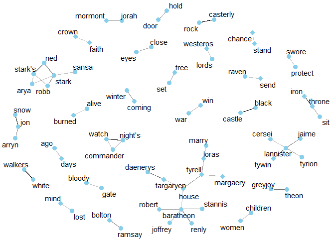
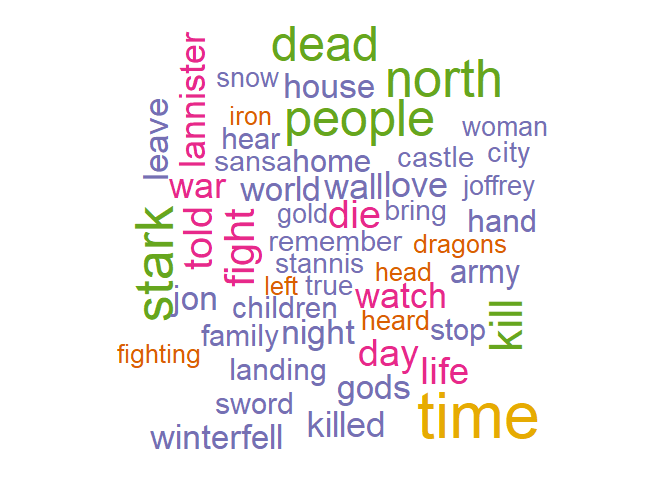
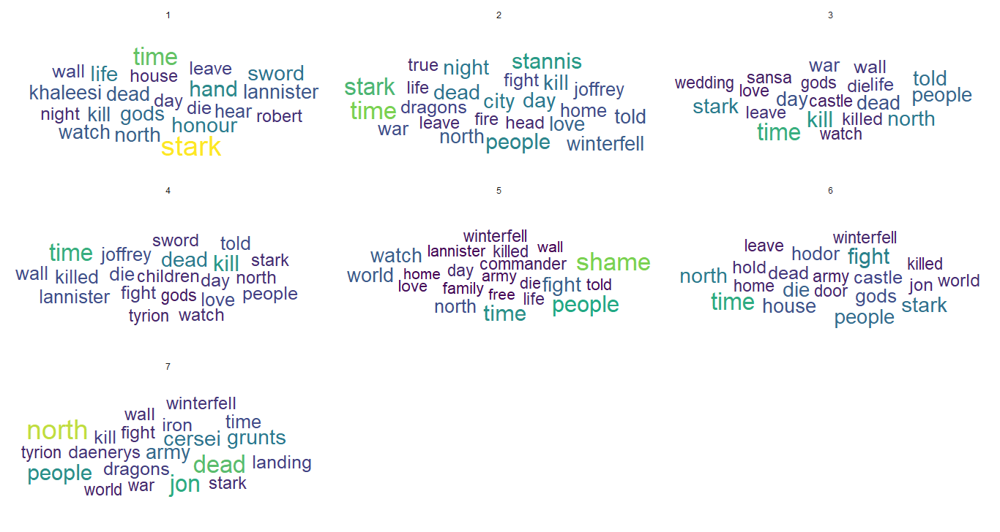
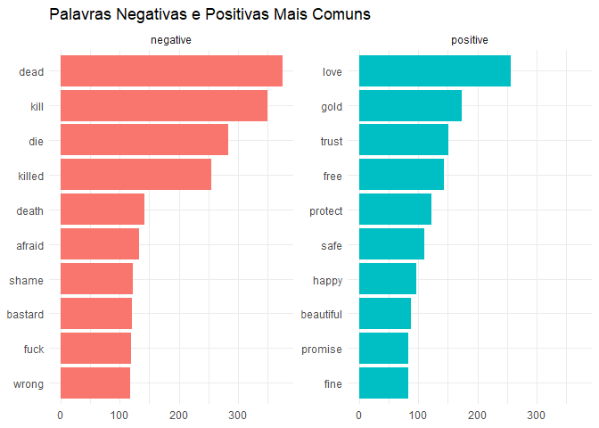
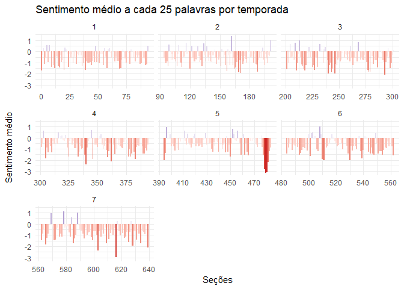
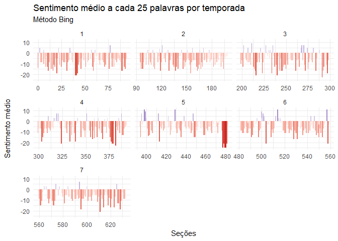

Neste post procuro visualizar dados textuais das legendads de Game of Thrones
com o R, utilizando o pacote [`tidytext`](https://www.tidytextmining.com), que
torna trivial esse tipo de tarefa.

A ideia é transformar um bloco de texto, como um livro, em um tidy DataFrame. No
nosso, caso faremos com as legendas de GOT.

# Obtendo os dados

Os dados brutos foram coletados
[aqui](https://www.kaggle.com/gunnvant/game-of-thrones-srt), formato JSON. São 7
arquivos, que contêm todas as legendas para as sete temporadas de GOT.
Felizmente, há uma biblioteca para ler arquivos JSON no R, o `jsonlite`.

No código abaixo, o que fiz foi ler cada arquivo, aplicando a função
`jsonlite::fromJSON()` a cada um deles com `purrr::map()`, o que me dá uma
lista. Depois, transformei essa lista em um vetor com `unlist()`, que por fim
transformei em um data.frame com `tibble::enframe()`.

```r
library(jsonlite)
library(tidyverse)

setwd("~/got_subtitles/")

# vetor com o endereço dos arquivos
arquivos <- dir(path = getwd(), pattern = "json$", full.names = T)

# lendo os arquivos
got_subs_raw <- map(arquivos, ~ fromJSON(.x)) %>%
  unlist() %>%
  enframe()

got_subs_raw
```

    ## # A tibble: 44,890 x 2
    ##    name                             value
    ##    <chr>                            <chr>
    ##  1 Game Of Thrones S01E01 Winter I~ Easy, boy.
    ##  2 Game Of Thrones S01E01 Winter I~ Our orders were to track the wildlings.
    ##  3 Game Of Thrones S01E01 Winter I~ - Right. Give it here. - No!
    ##  4 Game Of Thrones S01E01 Winter I~ Put away your blade.
    ##  5 Game Of Thrones S01E01 Winter I~ - I take orders from your father, not ~
    ##  6 Game Of Thrones S01E01 Winter I~ I'm sorry, Bran.
    ##  7 Game Of Thrones S01E01 Winter I~ Lord Stark?
    ##  8 Game Of Thrones S01E01 Winter I~ There are five pups.
    ##  9 Game Of Thrones S01E01 Winter I~ One for each of the Stark children.
    ## 10 Game Of Thrones S01E01 Winter I~ The direwolf is the sigil of your hous~
    ## # ... with 44,880 more rows

Agora vamos limpar esse DataFrame, procurando extrair variáveis interessantes
como temporada, número e nome do episódio etc.

Primeiro vamos retirar o prefixo 'Game of Throns S', o que nos deixa com '01E01
Winter Is Coming', '{Temporada}E{Episódio} {Nome do episódio}'. Vamos usar
regexes para extrair cada parte individualmente.

```r
got_subs <- got_subs_raw %>%
  mutate(
    name = str_remove(name, "Game Of Thrones S"),
    season_episode = str_extract(name, "\\d+E\\d+"),
    name = str_match(name, "([A-z,' ]+)\\.srt")[, 2] %>% trimws()
  ) %>%

  # separando a temporada do episódio
  separate(season_episode, c("season", "episode"), sep = "E") %>%

  # transformando o que é número para numeric
  mutate(
    season = as.numeric(season),
    episode = as.numeric(episode)
  ) %>%
  select(season, episode, name, value)

got_subs
```

    ## # A tibble: 44,890 x 4
    ##    season episode name          value
    ##     <dbl>   <dbl> <chr>         <chr>
    ##  1      1       1 Winter Is Co~ Easy, boy.
    ##  2      1       1 Winter Is Co~ Our orders were to track the wildlings.
    ##  3      1       1 Winter Is Co~ - Right. Give it here. - No!
    ##  4      1       1 Winter Is Co~ Put away your blade.
    ##  5      1       1 Winter Is Co~ - I take orders from your father, not you.~
    ##  6      1       1 Winter Is Co~ I'm sorry, Bran.
    ##  7      1       1 Winter Is Co~ Lord Stark?
    ##  8      1       1 Winter Is Co~ There are five pups.
    ##  9      1       1 Winter Is Co~ One for each of the Stark children.
    ## 10      1       1 Winter Is Co~ The direwolf is the sigil of your house.
    ## # ... with 44,880 more rows

Podemos tornar isso se quebrarmos a coluna `value` em unidades menores, como
palavras. O pacote `tidytext` tem uma função para isso, chamada `unnest_tokens`.
É mais geral e pode servir para separar um texto em caracteres, frases,
parágrafos etc.

Será útil também a função `rownames_to_column`, para podermos saber quais
palavras pertencem à mesma frase após a separação etc.

```r
library(tidytext)

got_words <- got_subs %>%
  rownames_to_column() %>%
  unnest_tokens(word, value)

got_words
```

    ## # A tibble: 286,901 x 5
    ##    rowname season episode name             word
    ##    <chr>    <dbl>   <dbl> <chr>            <chr>
    ##  1 1            1       1 Winter Is Coming easy
    ##  2 1            1       1 Winter Is Coming boy
    ##  3 2            1       1 Winter Is Coming our
    ##  4 2            1       1 Winter Is Coming orders
    ##  5 2            1       1 Winter Is Coming were
    ##  6 2            1       1 Winter Is Coming to
    ##  7 2            1       1 Winter Is Coming track
    ##  8 2            1       1 Winter Is Coming the
    ##  9 2            1       1 Winter Is Coming wildlings
    ## 10 3            1       1 Winter Is Coming right
    ## # ... with 286,891 more rows

Vamos contar quais são as palavras mais comuns:

```r
got_words %>%
  count(word, sort = T)
```

    ## # A tibble: 9,695 x 2
    ##    word      n
    ##    <chr> <int>
    ##  1 the   11856
    ##  2 you   10585
    ##  3 i     10267
    ##  4 to     7864
    ##  5 a      6006
    ##  6 and    5064
    ##  7 of     4430
    ##  8 your   3342
    ##  9 my     3234
    ## 10 it     2962
    ## # ... with 9,685 more rows

A maioria são preposições, pronomes etc., o que não é muito interessante.
Felizmente, isso é muito facilmente resolvido por esse pacote. Basta rodar um
`dplyr::anti_join` com um dataset que contém essas palavras, conhecidas como
‘stop words’.

```r
got_words <- got_words %>%
  anti_join(stop_words)
```

    ## Joining, by = "word"

```r
got_words %>%
  count(word, sort = T)
```

    ## # A tibble: 9,079 x 2
    ##    word        n
    ##    <chr>   <int>
    ##  1 lord     1133
    ##  2 king      831
    ##  3 father    693
    ##  4 grace     517
    ##  5 time      513
    ##  6 lady      510
    ##  7 north     412
    ##  8 stark     409
    ##  9 people    394
    ## 10 brother   393
    ## # ... with 9,069 more rows

E aqui vemos algo mais específico de GOT, mas essas palavras são assim tão
frequentes por serem pronomes de tratamento de GOT, são as stop words desse
universo. Por isso, achei prudente retirá-las.

```r
got_stop_words <- c(
  "father", "mother", "queen", "king",
  "boy", "girl", "lord", "lady", "son", "sister",
  "grace", "ser", "brother", "sister", "king's"
)

got_words <- got_words %>%
  filter(!(word %in% got_stop_words)) %>%
  add_count(word)

got_words %>%
  count(word, sort = T)
```

    ## # A tibble: 9,065 x 2
    ##    word       n
    ##    <chr>  <int>
    ##  1 time     513
    ##  2 north    412
    ##  3 stark    409
    ##  4 people   394
    ##  5 dead     375
    ##  6 kill     349
    ##  7 fight    313
    ##  8 told     295
    ##  9 die      284
    ## 10 life     278
    ## # ... with 9,055 more rows

E aqui as coisas começam a ficar interessantes\!

A [base limpa com essas palavras pode ser baixada aqui](./got_words.csv).

# Correlação entre as palavras

Agora, vamos visualizar quais as palavras que aparecem juntas com mais
frequência, com a função `pairwise_cor` do pacote `widyr`.

Só precisamos filtrar nossa base antes, porque não queremos que o R compare cada
par de 81579 palavras: escolheremos as palavras que apareçam 50 vezes ou mais.

```r
library(widyr)

word_pairs <- got_words %>%
  add_count(word) %>%
  filter(n >= 50) %>%
  pairwise_cor(word,
    rowname,
    sort = T
  )

word_pairs
```

    ## # A tibble: 109,892 x 3
    ##    item1    item2    correlation
    ##    <chr>    <chr>          <dbl>
    ##  1 color    font           0.968
    ##  2 font     color          0.968
    ##  3 rock     casterly       0.908
    ##  4 casterly rock           0.908
    ##  5 watch    night's        0.674
    ##  6 night's  watch          0.674
    ##  7 white    walkers        0.639
    ##  8 walkers  white          0.639
    ##  9 jon      snow           0.540
    ## 10 snow     jon            0.540
    ## # ... with 109,882 more rows

Dentre alguns resultado interessantes, nos deparamos com um bastante anormal.
color font? font color? Isso é código HTML usado para formatação que acabou
entrando no documento, que eventualmente serão ignoradas.

Para visualizar essas relações, vamos usar grafos. Nele as palavras são nós e os
vértices as corrrelações (um vértice mais escuro indica uma correlação mais
alta), teremos assim uma network dos top 100 par de palavras mais
correlacionados entre si.

```r
library(ggraph)
library(igraph)

set.seed(0)

word_pairs %>%
  filter(!(item1 %in% c("font", "color", "game"))) %>%
  top_n(100) %>%
  graph_from_data_frame() %>%
  ggraph(layout = "fr") +
  geom_edge_link(aes(edge_alpha = correlation),
    show.legend = F
  ) +
  geom_node_point(
    color = "skyblue",
    size = 3
  ) +
  geom_node_text(aes(label = name),
    repel = T
  ) +
  theme_void()
```

<!-- -->

# Palavras mais frequentes

Agora, vamos visualizar quais as palavras mais frequentes em geral e por
temporada. Para isso vamos utilizar nuvem de palavras.

O em geral primeiro. Vamos ver quais são as top 50 palavras em uma nuvem, com a
função `wordcloud::wordcloud`, que toma como argumentos principais um vetor de
palavras e um de frequências.

```r
library(wordcloud)
library(RColorBrewer)

paleta <- brewer.pal(6, "Dark2")

set.seed(99)

got_words %>%
  count(word) %>%
  with(wordcloud(word,
    n,
    max.words = 50,
    colors = paleta
  ))
```

<!-- -->

Agora, vamos ver como isso varia para cada temporada, com o pacote
`ggwordcloud`.

```r
library(ggwordcloud)

theme_set(theme_minimal())

got_words <- got_words %>%
  filter(!str_detect(word, "font|color"))

got_words %>%
  count(season, word, name = "count") %>%
  group_by(season) %>%
  top_n(20, count) %>%
  ggplot(aes(
    label = word,
    size = count,
    color = count %>% as.numeric()
  )) +
  geom_text_wordcloud(rm_outside = T) +
  scale_size_area(max_size = 10) +
  scale_color_viridis_c() +
  facet_wrap(. ~ season, nrow = 3, ncol = 3)
```

<!-- -->

# Análise de sentimentos

Outra coisa que é interessante de ser feita é analisar o sentimento médio do
texto, se nele há mais palavras consideradas negativas ou positivas etc.

Esse é um tópico delicado teoricamente, já que não é algo tão trivial para um
computador deduzir se uma frase expressa um sentimento bom ou ruim. Não vamos
deixar o computador fazer isso, mas usar um léxico que mapeia palavras a
sentimentos, feito por humanos.

Por exemplo, o léxico `afinn` classifica algumas mil palavras em uma escala que
varia de -5 (muito negativo) até 5 (muito positivo).

```r
get_sentiments("afinn")
```

    ## # A tibble: 2,476 x 2
    ##    word       score
    ##    <chr>      <int>
    ##  1 abandon       -2
    ##  2 abandoned     -2
    ##  3 abandons      -2
    ##  4 abducted      -2
    ##  5 abduction     -2
    ##  6 abductions    -2
    ##  7 abhor         -3
    ##  8 abhorred      -3
    ##  9 abhorrent     -3
    ## 10 abhors        -3
    ## # ... with 2,466 more rows

Já esse classifica cada palavra binariamente, em ‘negativa’ ou ‘positiva’,
cobrindo uma porção maior de palavras.

```r
get_sentiments("bing")
```

    ## # A tibble: 6,788 x 2
    ##    word        sentiment
    ##    <chr>       <chr>
    ##  1 2-faced     negative
    ##  2 2-faces     negative
    ##  3 a+          positive
    ##  4 abnormal    negative
    ##  5 abolish     negative
    ##  6 abominable  negative
    ##  7 abominably  negative
    ##  8 abominate   negative
    ##  9 abomination negative
    ## 10 abort       negative
    ## # ... with 6,778 more rows

Outra base possível de ser usada é essa, que cobre muito mais palavras e
categorias, além de ter mais palavras positivas (em relação às negativas) que a
base 'bing'.

```r
get_sentiments("nrc")
```

    ## # A tibble: 13,901 x 2
    ##    word        sentiment
    ##    <chr>       <chr>
    ##  1 abacus      trust
    ##  2 abandon     fear
    ##  3 abandon     negative
    ##  4 abandon     sadness
    ##  5 abandoned   anger
    ##  6 abandoned   fear
    ##  7 abandoned   negative
    ##  8 abandoned   sadness
    ##  9 abandonment anger
    ## 10 abandonment fear
    ## # ... with 13,891 more rows

Vamos aplicar a análise de sentimento com as três e ver como elas se
diferenciam.

Vejamos primeiro quais são as palavras negativas e positivas mais comuns.

```r
got_bing <- got_words %>%
  filter(word != "stark") %>%
  select(-rowname) %>%
  inner_join(get_sentiments("bing"))
```

    ## Joining, by = "word"

```r
got_bing %>%
  distinct(word, .keep_all = T) %>%
  group_by(sentiment) %>%
  top_n(10, n) %>%
  ggplot(aes(fct_reorder(word, n),
    n,
    fill = sentiment
  )) +
  geom_col(show.legend = F) +
  coord_flip() +
  facet_wrap(. ~ sentiment, scale = "free_y") +
  labs(
    x = NULL, y = NULL,
    title = "Palavras Negativas e Positivas Mais Comuns"
  )
```

<!-- -->

Agora, vamos fazer isso em por temporada e medir o sentimento médio a cada seção
de n palavras.

Vamos usar o dataset `afinn` e uma seção formada por 25 palavras.

```r
got_afinn <- got_words %>%
  inner_join(get_sentiments("afinn")) %>%
  select(-rowname, -n) %>%
  mutate(
    row = row_number(),
    section = row %/% 25
  ) %>%
  ungroup()
```

    ## Joining, by = "word"

```r
got_afinn %>%
  group_by(season, section) %>%
  summarise(avg_sentiment = mean(score)) %>%
  ggplot(aes(section,
    avg_sentiment,
    fill = avg_sentiment
  )) +
  geom_col(show.legend = F) +
  labs(
    x = "Seções", y = "Sentimento médio\n",
    title = "Sentimento médio a cada 25 palavras por temporada"
  ) +
  scale_fill_gradient2(
    low = "firebrick3",
    high = "dodgerblue3"
  ) +
  facet_wrap(season ~ ., scale = "free_x")
```

<!-- -->

Em geral, podemos ver que as temporadas foram ficando mais pesadas. Os picos
azuis claros foram ficando cada vez mais raros e os vales vermelhos mais agudos,
chegando a seu clímax na temporada 5, o Walk of Shame.

Vamos tentar o mesmo com as outras duas bases. Como elas classificam as palavras
binariamente, a ideia é calcular o 'sentimento líquido', o que se entende pela
diferença no número de palavras positivas e negativas, para cada seção.

```r
got_bing %>%
  select(-n) %>%
  mutate(
    row = row_number(),
    section = row %/% 25
  ) %>%
  count(season, episode, section, sentiment) %>%
  spread(sentiment, n, fill = 0) %>%
  mutate(net_sentiment = positive - negative) %>%
  ggplot(aes(section,
    net_sentiment,
    fill = net_sentiment
  )) +
  geom_col(show.legend = F) +
  scale_fill_gradient2(
    low = "firebrick3",
    high = "navyblue"
  ) +
  facet_wrap(. ~ season, scale = "free_x") +
  labs(
    x = "Seções", y = "Sentimento médio\n",
    title = "Sentimento médio a cada 25 palavras por temporada",
    subtitle = "Método Bing"
  )
```

<!-- -->

Ok, isso em geral vai de encontro com o que já havíamos visto.

```r
got_nrc <- got_words %>%
  filter(word != "stark") %>%
  select(-rowname) %>%
  inner_join(get_sentiments("nrc") %>%
    filter(sentiment %in% c("negative", "positive")))
```

    ## Joining, by = "word"

```r
got_nrc %>%
  select(-n) %>%
  mutate(
    row = row_number(),
    section = row %/% 25
  ) %>%
  count(season, episode, section, sentiment) %>%
  spread(sentiment, n, fill = 0) %>%
  mutate(net_sentiment = positive - negative) %>%
  ggplot(aes(section,
    net_sentiment,
    fill = net_sentiment
  )) +
  geom_col(show.legend = F) +
  scale_fill_gradient2(
    low = "firebrick3",
    high = "navyblue"
  ) +
  facet_wrap(. ~ season, scale = "free_x") +
  labs(
    x = "Seções", y = "Sentimento médio\n",
    title = "Sentimento médio a cada 25 palavras por temporada",
    subtitle = "Método NRC"
  )
```

<!-- -->

Pera! Já esse nos dá quase que o resultado oposto! De fato, por esse método a
série não parece ser tão negativa quanto os outros haviam sugerido. Isso porque
essa base tem muito mais palavras positivas em relação a negativas. Palavras
como 'land', 'prince' etc. são nela 'positivas', enquanto que nas outras, não.
Por ter mais palavras, aumentam também o número de seções.

Enfim, esse é um ponto delicado, incluído aqui somente por ser interessante em
si mesmo.
