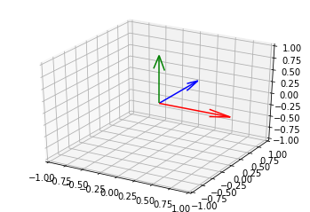
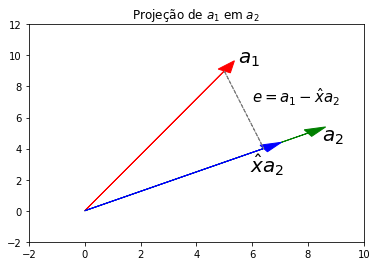

Em Álgebra Linear, processo de Gram-Schmidt é um algoritmo usado para tornar um
conjunto de vetores perpendiculares entre si (o que também se conhece por
ortogonalização).

Esse processo de ortogonalização é útil porque torna fácil numericamente
operações custosas como a inversão de uma matriz. Isso vem simplesmente do fato
do produto interno de dois vetores perpendiculares entre si ser 0.

Intuitivamente, se interpretarmos o produto interno como uma "projeção" de um
vetor sobre o outro, isso quer dizer que os dois vetores não tem uma
"correlação" em termos de direção. Geometricamente, também quer dizer que eles
estão separados por um ângulo de 90º.

Por exemplo, os três vetores abaixo são vetores ortogonais:

```python
%matplotlib inline
import matplotlib.pyplot as plt

fig = plt.figure()
ax = fig.add_subplot(projection='3d')

ax.quiver(0, 0, 0, 1, 0, 0, color="red")
ax.quiver(0, 0, 0, 0, 1, 0, color="blue")
ax.quiver(0, 0, 0, 0, 0, 1, color="green")

ax.set_xlim(-1, 1, 1)
ax.set_ylim(-1, 1, 1)
ax.set_zlim(-1, 1, 1)
```



Para ver isso com matrizes, vamos supor uma matriz \\( Q \\) cujas colunas são
vetores ortogonais com o comprimento
([norma](<https://en.wikipedia.org/wiki/Norm_(mathematics)>)) igual a 1, o que
quer dizer que eles são _ortonormais_.

Se isso é verdade, então podemos dizer que \\( Q^{T}Q = I \\). E, se \\( Q \\)
for quadrada, então \\( Q^T \\) é a inversa de \\( Q \\)\!\!

Isso porque

\\( q^{T}\_{i}q_j = \begin{cases} 0, & \text{se } i \neq j \cr 1, & \text{se } i
= j \end{cases} \\)

É dessa forma que uma operação complexa como inverter uma matriz torna-se
trivial no caso de uma matriz ortogonal.

Então entra a ideia de Gram-Schmidt, que procura transformar uma matriz \\( A
\\) qualquer em uma matriz com vetores ortonormais \\( Q \\) e uma matriz \\( R
\\) que conecta as duas:

$$
A = QR
$$

Como eles fazem isso? A ideia básica é a seguinte e está intimamente ligada ao
conceito de projeção. Por isso, vamos entender o que é isso antes.

Abaixo, uma imagem da projeção de um vetor \\( a_1 \\) sobre \\( a_2 \\).

```python
import numpy as np

np.random.seed(1)
A = np.random.randint(0, 10, 4).reshape((2, 2))

fig, ax = plt.subplots()

a1 = A[:, 0]
a2 = A[:, 1]
projection = (a1.dot(a2) / a1.dot(a1)) * a2
e = a1 - projection

ax.arrow(0, 0, *a1, color="red", head_width=0.5)
ax.arrow(0, 0, *a2, color="green", head_width=0.5)
ax.arrow(0, 0, *projection, color="blue", head_width=0.5)
ax.arrow(*projection, *e, color="grey", linestyle="--")

ax.set_xlim(-2, 10)
ax.set_ylim(-2, 12)

ax.annotate("$a_1$", a1 + 0.5, fontsize=20)
ax.annotate("$a_2$", a2 + [0.5, -0.5], fontsize=20)
ax.annotate("$\hat{x}a_2$", projection - [0.5, 1.5], fontsize=20)
ax.annotate("$e = a_1 - \hat{x}a_2$", e + projection + [1, -2], fontsize=15)
ax.set_title(r"Projeção de \\( a_1 \\) em \\( a_2 \\)")
```



Dados esses dois vetores, podemos gerar um vetor perpendicular ao \\( a_2 \\)
que denominaremos \\( e \\), que é o resultado da subtração em \\( a_1 \\) do
que ele tem em comum com \\( a_2 \\) (o \\( \hat{x} \\)).

Ou seja, o \\( \hat{x} \\) é o coeficiente de projeção, que denota o quanto \\(
a_1 \\) e \\( a_2 \\) se assemelham em termos de direção. Enquanto que \\( e =
a_1 - \hat{x} a_2 \\) é o erro da projeção.

Como \\( e \\) é perpendicular a \\( a_2 \\), temos que:

$$
a_2^{T} (e) = 0 \newline
a_2^{T} (a_1 - \hat{x} a_2) = 0 \newline
\hat{x}a^{T}_2a_2 = a_2^{T}a_1 \newline
\hat{x} = \frac{a^{T}_2a_1}{a^{T}_2a_2}
$$

Se você reparar bem, essa foi exatamente a conta que eu fiz para obter a
variável de nome `projection` no código acima.

Isso pode ser generaliza para um sistema de equações e é conhecido como equações
normais e é o que fundamenta o modelo clássico de regressão linear.

A fórmula é bem parecida com a de cima e a interpretação também: ela projeta o
vetor \\( b \\) no espaço vetorial expandido pelos vetores de \\( A \\).

$$
\hat{x} = (A^TA)^{-1}A^Tb
$$

O vetor projetado em \\( A \\) é então simplesmente \\( A\hat{x} \\), o produto
do que agora chamaremos matriz de projeção, \\( A(A^TA)^{-1}A^T \\), com o vetor
\\( b \\):

$$
\hat{b} = A\hat{x} = A(A^TA)^{-1}A^Tb
$$

E, para obter o erro da projeção:

$$
e = b - A\hat{x} = b - A(A^TA)^{-1}A^Tb = (I - A(A^TA)^{-1}A^T)b
$$

E assim vemos que assim como há a matriz de projeção de \\( b \\) sobre o
sub-espaço expandido pelos vetores de \\( A \\), há também a projeção de \\( b
\\) sobre o sub-espaço ortogonal, que é obtido ao multiplicar \\( b \\) com a
matriz denominada como _annihilator matrix_, \\( (I - A(A^TA)^{-1}A^T) \\). Essa
matriz é a _residual maker_ na regressão linear. E é justamente o que iremos
precisar.

Agora, para o algoritmo propriamente dito. Vamos usar uma matriz 3x3 qualquer e
tentar torná-lo ortogonal.

```python
np.random.seed(1)
A = np.random.randint(0, 10, 9).reshape((3, 3))

A
```

    array([[5, 8, 9],
           [5, 0, 0],
           [1, 7, 6]])

O primeiro vetor não precisa ser ortogonalizado, vamos dividindo-o por seu
próprio comprimento para torná-lo normal (com norma 1).

Já o segundo, queremos ortogonalizar em relação ao primeiro. E para isso vamos
usar a _annhilator matrix_.

No caso do terceito, faremos o mesmo mas sobre o espaço expandido pelos dois
primeiros vetores.

Vamos ver se isso funciona. O código abaixo replica esse processo.

```python
def orthogonalize(A, n):
    # vetor a ser ortogonalizado
    b = A[:, n][:, np.newaxis]
    # se for o primeiro vetor, somente normalize (norma igual a um)
    if n == 0:
        return b / np.linalg.norm(b)
    # se não, vamos ortogonalizar
    else:
        # espaço vetorial preenchido pelos vetores antecessores
        # sobre o qual precisamos projetar o vetor b
        X = A[:, range(0, n)]
        # matriz identidade NxN (N = número de linhas)
        I = np.eye(X.shape[0])
        # construir a annihilator matrix, para projetar o vetor b no sub-espaço
        # ortogonal ao espaço coluna de X, em R^n
        M = I - X @ np.linalg.inv(X.T @ X) @ X.T
        # fazer a projeção e retornar normalizado
        e = M.dot(b)
    return e / np.linalg.norm(e)


def q(A):
    return np.concatenate([orthogonalize(A, i) for i in range(3)], axis=1)


Q = q(A)
Q
```

    array([[ 0.70014004,  0.40635191,  0.58709629],
           [ 0.70014004, -0.55198092, -0.45290285],
           [ 0.14002801,  0.72814504, -0.67096718]])

Se tudo está correto, a multiplicação \\( Q^{T}Q \\) deve retornar a identidade:

```python
Q.T.dot(Q)
```

    array([[ 1.00000000e+00, -1.38777878e-17, -8.04911693e-16],
           [-1.38777878e-17,  1.00000000e+00,  6.66133815e-16],
           [-8.04911693e-16,  6.66133815e-16,  1.00000000e+00]])

O que felizmente é o nosso caso.

Isso também é conhecido como mudar a base de uma matriz, para uma muito mais
fácil de se lidar numericamente.

Para obter a mesma matriz Q de forma mais confiável, você pode usar a função
`np.linalg.qr()`, que vai te retornar a matriz \\( Q \\) que obtemos e a matriz
\\( R \\) que conecta \\( Q \\) a \\( A \\).

Aqui está a aula em que Gilbert Strang explica esse conceito:


