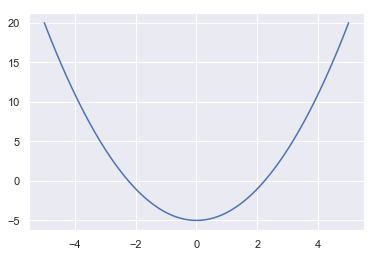
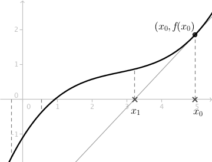
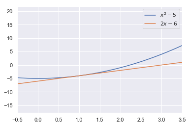
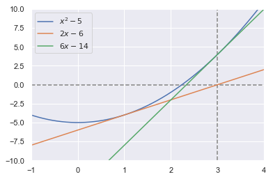
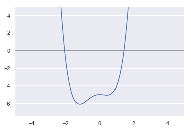
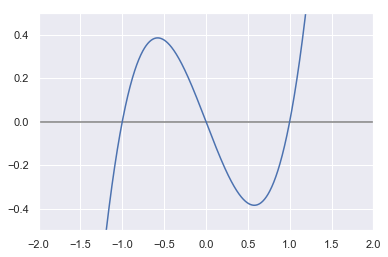
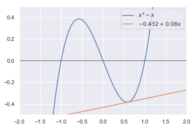

# Introdução

O Método de Newton é um conhecido algoritmo para chegar a soluções
númericas de uma equação, normalmente uma para a qual a solução não é
tão trivial. Por exemplo, imagine que queiramos encontrar encontrar a
raiz da função quadrática \\( x = \sqrt{5} \Rightarrow x^2 = 5
\Rightarrow x^2 - 5 = 0 \\). Como poderíamos fazer isso?

Newton criou um método (verdadeiramente um algoritmo)
extraordinariamente eficiente para chegar à solução, em que se faz uso
de seus estudos em cálculo diferencial.

Calcular \\( \sqrt{5} \\), hoje em dia, é trivial, basta qualquer calculadora.
Mas, como será que a calculadora faz esse cálculo? Talvez seja esse
o algoritmo que ela mesma usa. Vamos entender como isso funciona então.

Para melhor entendimento do problema, vejamos o gráfico da função antes.

``` python
%matplotlib inline
import matplotlib.pyplot as plt
import seaborn as sns
import numpy as np

sns.set()

def f(x): return x**2 - 5
X = np.linspace(-5, 5, 500)

plt.plot(X, f(X))
```



Podemos verificar que ela intercepta o eixo x quando \\( x \\) é um pouquinho
acima de 2, quer dizer, quando \\( x = \sqrt{5} \approx 2.23 \\).

Ok, mas como chegamos até ali com cálculo diferencial? O raciocínio é
como segue: vamos fazer uma estimativa inicial, um valor que achamos que
seja próximo da solução. Por exemplo, 1.

Com esse valor, a ideia é obter a reta tangente àquele ponto, o que é
algo muito mais fácil de lidar. E, para isso, é claro que precisamos
calcular \\( f^{'}(1) \\), a inclinação dessa reta naquele ponto.

E, com ela em mãos, queremos achar onde *essa reta* intercepta o eixo x,
e este deve ser um ponto mais próximo da raiz, mas não exatamente a
raiz. Isto porque estamos calculando a raiz de uma reta pra nos
aproximarmos da raiz de uma parábola, que não é linear, é claro.



Até então, o método não parece tão impressionante. Mas e se fizermos
isso de novo, usando como estimativa a raiz dessa reta? Acontece que se
repetirmos esse processo algumas vezes mais podemos chegar numa
estimativa *muito* próxima da solução.

# Aproximação Linear

Esse uso da reta tangente é o que se conhece por aproximação linear. Por
exemplo, retomando a função quadrática. A derivada dela é obtida pela
regra da potência, \\( \frac{d(x^2)}{dx} = 2x \\). Já a equação da tangente é
obtida simplesmente da equação de uma reta:

$$
\Delta y = f'(x)\Delta x \\ (y - y_0) = f'(x_0)(x - x_0) \\ y =
y_0 + m(x - x_0)
$$

No nosso caso, queremos achar a reta tangente quando \\( x_0 = 1 \\), sendo
\\( f(x_0) = x^2 - 5 = 1 - 5 = -4 \\). Logo, a reta que tangencia o ponto
\\( (1, -4) \\) é:

$$
y = y_0 + 2x(x - x_0) \\ y = -4 + 2\cdot 1(x - 1) \\ y = -4 + 2x
-2 \\ y = 2x - 6 
$$

Mas, é crucial perceber que essa é a *equação da reta tangente ao ponto
\\( (x_0, y_0) \\) da função f(x)*. Então, o que realmente podemos alegar é
que, para um dado número \\( a \\), o valor de \\( f(a) \approx y(a) \\), quando \\( a
\approx x_0 \\): a reta tangente a um dado ponto de uma função é muito
próxima da própria função para valores não muito distantes do ponto.

$$
f(a) \approx y_0 + m(a - x_0)
$$

No gráfico abaixo isso pode ser melhor visualizado. Perceba que para
valores próximos de 1, a reta tangente está bem próxima da parábola, mas
vai ficando cada vez mais distante quando x se afasta de 1. E é esse o
sentido de uma aproximação linear.

``` python
def tang(x):
    return 2 * x - 6


plt.plot(X, f(X), label=r"$x^2 - 5$")
plt.plot(X, tang(X), label=r"$2x - 6$")
plt.xlim(-0.5, 3.5)
plt.legend()
```



Nesse zoom, também podemos ver que a reta tangente ao ponto \\( (1, -4) \\)
cruza o eixo \\( x \\) um pouco mais adiante de \\( 2.23 \\). Mais especificamente,
quando \\( 2x - 6 = 0 \Rightarrow 2x = 6 \Rightarrow x = 3 \\).

O que é um pouco mais próximo da raiz do que a estimativa inicial 1. E é
exatamente nisso que consiste o Método de Newton, em se aproximar cada
vez mais da raiz de \\( f(x) \\) usando a reta que tangencia um dado ponto
desta função.

Assim, nosso objetivo fica melhor delineado dessa forma: queremos sempre
o valor de \\( x \\) da reta tangente a um ponto \\( (x_0, y_0) \\) que faz com
que \\( y = 0 \\):

$$
y - y_0 = m(x - x_0) \text{ dividindo tudo por m e sumindo com o y: } \newline
\frac{y_0}{m} = x - x_0 \Rightarrow x = x_0 - \frac{y_0}{m} \newline
\text{ o que também pode ser escrito como: } \newline
x = x_0 - \frac{f(x_0)}{f'(x_0)} \Rightarrow x_{n+1} = x_n - \frac{f(x_n)}{f'(x_n)} \newline
$$

Plugando os valores de nossa estimativa inicial, obtemos:

$$
x = 1 - \frac{1^2 - 5}{2\cdot1} = 1 - \frac{-4}{2} = 1 - (-2) = 3
$$

E a ideia é usarmos o 3 como um novo \\( x_0 \\), e com ele calcularmos uma
nova estimativa para a raiz com a reta que tangencia \\( (3, 4) \\).

$$
x = 3 - \frac{3^2 - 5}{2\cdot3} = 3 - \frac{4}{6} = 3 - \frac{2}{3} \approx 2.333
$$

O que já é uma ótima aproximação de \\( \sqrt{5} \\). Abaixo um gráfico do
que mais ou menos aconteceu. A função laranja é a tangente ao ponto \\( (1,
-4) \\), e a verde ao ponto \\( (3, 4) \\). Veja como o intercepto-x da tangente
a este último ponto é próximo da raiz da parábola.

``` python
def f(x):
    return x ** 2 - 5


def tangente_um(x):
    return 2 * x - 6


def tangente_dois(x):
    return 6 * x - 14


X = np.linspace(-5, 5, 1000)

plt.plot(X, f(X), label=r"$x^2 - 5$")
plt.plot(X, tangente_um(X), label=r"$2x - 6$")
plt.plot(X, tangente_dois(X), label=r"$6x - 14$")

plt.hlines(0, -1, 4, "grey", "dashed")
plt.vlines(3, -10, 10, "grey", "dashed")

plt.xlim(-1, 4)
plt.ylim(-10, 10)
plt.legend()
```



Seria interessante escrevermos uma função para fazer esses cálculos, e
ela inevitavelmente teria lidar com cálculo diferencial. Para isso,
existe uma biblioteca que pode nos ajudar.

# Introduzindo SymPy

Essa biblioteca fornece suporte para trabalhar com álgebra simbólica.
Nela contamos com funções para calcular limites, derivadas, integrais,
expandir polinômicos, simplificar expressões etc.

Por exemplo, se quisermos calcular a derivada da função \\( x^2 - 5 \\).

``` python
from sympy import symbols, diff, limit, integrate, oo

x = symbols("x")

diff(x ** 2 - 5)
```

    2*x

Podemos também calcular limites, por exemplo \\( \lim_{x \to \infty}
\frac{1}{x} = 0 \\)

``` python
limit(1 / x, x, oo)
```

``` 
0
```

Ou mesmo integrais indefinidas, \\( \int x^2 , dx = \frac{x^3}{3} + c \\)

``` python
integrate(x ** 2)
```

    x**3/3

A função assim como está não serve para retornar qualquer valor, ela
praticamente só aceita funções do próprio SymPy. Para a utilizarmos como
uma função qualquer, devemos usar `  lambdify() `. Para nossos
objetivos, essa última e a função diff serão suficientes.

# Um código para o algoritmo

Antes de apresentar a função em si, melhor explicar como eu a pensei.

Primeiramente, ela tomará três argumentos: a função, o valor para o qual
queremos uma solução, e a estimativa inicial. Por exemplo, no nosso
caso, ela tomaria os argumentos \\( x^2 \\), \\( 5 \\) e \\( 1 \\).

Em seguida, construirei simbolicamente, com estes argumentos, nossa
\\( f(x) \\) e sua derivada, \\( f'(x) \\). E com isso temos tudo que precisamos
para executarmos o método.

No algoritmo, decidi por 5 iterações, printando três colunas com os
resultados a cada iteração: a estimativa inicial, a nova estimativa e,
por fim, a diferença entre as duas, a fim de verificar como a cada
iteração o valor de x se aproxima mais do da raiz.

``` python
from sympy.utilities.lambdify import lambdify


def newton(funcao, numero, estimativa):
    f = lambdify(x, funcao - numero)  # x^2 - 5
    df = lambdify(x, diff(funcao - numero))  # 2x

    print("est.    | nova est. | diferença")

    for _ in range(5):
        nova_est = estimativa - f(estimativa) / df(estimativa)
        print(
            f"{estimativa:.5f} | {nova_est:^ 9.5f} | {abs(nova_est - estimativa):.20f}"
        )
        estimativa = nova_est

    return estimativa


print(f"\nO quanto erramos: {abs(np.sqrt(5) - newton(x**2, 5, 1))}")
```

    est.    | nova est. | diferença
    1.00000 |  3.00000  | 2.00000000000000000000
    3.00000 |  2.33333  | 0.66666666666666651864
    2.33333 |  2.23810  | 0.09523809523809534383
    2.23810 |  2.23607  | 0.00202634245187471862
    2.23607 |  2.23607  | 0.00000091814338532004
    
    O quanto erramos: 1.8829382497642655e-13

E assim vemos que o erro foi desprezível.

A vantagem de usar o SymPy é que agora podemos estimar a raiz de
qualquer tipo de função. Por exemplo, a raiz cúbica de 5, ou algo mais
complicado:

``` python
print(f"\nO quanto erramos: {abs(5**(1/3) - newton(x**3, 5, 2))}")
```

    est.    | nova est. | diferença
    2.00000 |  1.75000  | 0.25000000000000000000
    1.75000 |  1.71088  | 0.03911564625850338928
    1.71088 |  1.70998  | 0.00090792482452184409
    1.70998 |  1.70998  | 0.00000048224014181919
    1.70998 |  1.70998  | 0.00000000000013589130
    
    O quanto erramos: 2.220446049250313e-16

Uma das raízes para função \\(  x^4 + x^3 - x^2 - 5 \\) deve ser:

``` python
newton(x ** 4 + x ** 3 - x ** 2, 5, 1)
```

    est.    | nova est. | diferença
    1.00000 |  1.80000  | 0.80000000000000004441
    1.80000 |  1.52529  | 0.27470795979353446192
    1.52529 |  1.43509  | 0.09020236587892971336
    1.43509 |  1.42600  | 0.00908943849525978287
    1.42600 |  1.42591  | 0.00008681126625442737
    
    1.4259134245660217

Se plotarmos seu gráfico, veremos que esse é um valor razoável. Uma raiz
parece estar entre 1 e 2, e foi a que achamos. E uma outra está muito
próxima de -2.

``` python
X = np.linspace(-5, 5, 1000)


def g(x):
    return x ** 4 + x ** 3 - x ** 2 - 5


plt.plot(X, g(X))
plt.hlines(0, -5, 5, color="grey")
plt.xlim(-5, 5)
plt.ylim(-7.5, 5)
```



Vamos tentar achar essa outra raiz com nossa função. Para isso, basta
mudarmos nossa estimativa inicial de forma a nos aproximarmos daquela
outra raiz.

``` python
newton(x ** 4 + x ** 3 - x ** 2, 5, -1.5)
```

    est.    | nova est. | diferença
    -1.50000 | -2.98333  | 1.48333333333333339255
    -2.98333 | -2.45626  | 0.52707184463468736979
    -2.45626 | -2.16542  | 0.29084549734551234934
    -2.16542 | -2.06890  | 0.09651451804451394167
    -2.06890 | -2.05885  | 0.01005450745933744727
    
    -2.0588469658492823

# Limitações do método

Essa é uma função complicadinha e expõe algumas limitações do método que
Newton criou. Por exemplo, imagine que usemos como estimativa um valor
próximo de um mínimo, digamos que 0.5.

``` python
newton(x ** 4 + x ** 3 - x ** 2, 5, 0.5)
```

    est.    | nova est. | diferença
    0.50000 |  20.75000 | 20.25000000000000000000
    20.75000 |  15.50807 | 5.24193178745838928023
    15.50807 |  11.57934 | 3.92872823960125217013
    11.57934 |  8.63653  | 2.94280653615018472635
    8.63653 |  6.43473  | 2.20180035062548107305
    
    
    6.434733086164693

O resultado foi bem catastrófico. É claro, não poderíamos esperar que
ele fosse infalível. Vejamos as razões pelas quais ele pode falhar.

Primeiro, é muito claro que o resultado final a que chegaremos depende
da estimativa inicial. Logo, se fizermos uma estimativa desarrazoada, é
muito provável que não cheguemos a uma solução pertinente.

Além disso, a derivada da função naquele ponto não deve ser muito
pequena. No limite, se ela for zero, teremos uma indefinição, uma
divisão por zero.

E se ela for muito pequena, a reta tangente será muito pouco inclinada e
jogará a estimativa para muito longe da raiz. E foi isso o que aconteceu
ali em cima. Por exemplo, consideremos a função \\( x^3 - x \\).

``` python
X = np.linspace(-2, 2, 1000)

plt.plot(X, X ** 3 - X)
plt.hlines(0, -5, 5, color="grey")
plt.xlim(-2, 2)
plt.ylim(-0.5, 0.5)
```



Pelo gráfico, salta à vista que as três raízes são 0, 1 e -1. Ok, mas
imagine que queiramos estimar a raiz não-nula positiva com este método.

Não poderíamos escolher 0.5 como estimativa, porque isso nos jogaria
para o outro lado e acabaríamos achando algo próximo da raiz negativa:

``` python
newton(x ** 3 - x, 1, 0.5)
```

    est.    | nova est. | diferença
    0.50000 | -5.00000  | 5.50000000000000000000
    -5.00000 | -3.36486  | 1.63513513513513508713
    -3.36486 | -2.28096  | 1.08390981119991192116
    -2.28096 | -1.55628  | 0.72467848569769000022
    -1.55628 | -1.04351  | 0.51277134078822550478
    
    -1.0435052271790375

E se escolhêssemos algo muito perto do mínimo, aquele mesmo fiasco
aconteceria.

``` python
newton(x ** 3 - x, 1, 0.6)
```

    est.    | nova est. | diferença
    0.60000 |  17.90000 | 17.29999999999998294697
    17.90000 |  11.94680 | 5.95319767139122291155
    11.94680 |  7.98552  | 3.96128197667255399494
    7.98552 |  5.35691  | 2.62861103714074939575
    5.35691 |  3.62500  | 1.73191328184936210732
    
    3.624996032946096

Como esperado, a tangente ali é pouquíssimo inclinada, e jogou a
estimativa para muito longe, tanto que em 5 tentativas não conseguimos
uma estimativa muito boa. Veja o gráfico.

``` python
X = np.linspace(-2, 2, 1000)

plt.plot(X, X ** 3 - X, label=r"$x^3 - x$")
plt.plot(X, -0.432 + 0.08 * X, label=r"$-0.432 + 0.08x$")

plt.hlines(0, -5, 5, color="grey")
plt.xlim(-2, 2)
plt.ylim(-0.5, 0.5)
plt.legend()
```



# Conclusões

O interessante desse algoritmo é ser uma aplicação de cálculo
diferencial. É bastante simples sem sacrificar o lado da eficiência, mas
também vimos que há certas limitações. É claro, ele não poderia fazer
milagres. Mas, hoje em dia, basta plotar o gráfico em questão para ter
uma ideia de onde estão as raízes, como acabamos de fazer aqui com a
ajuda do matplotlib.
