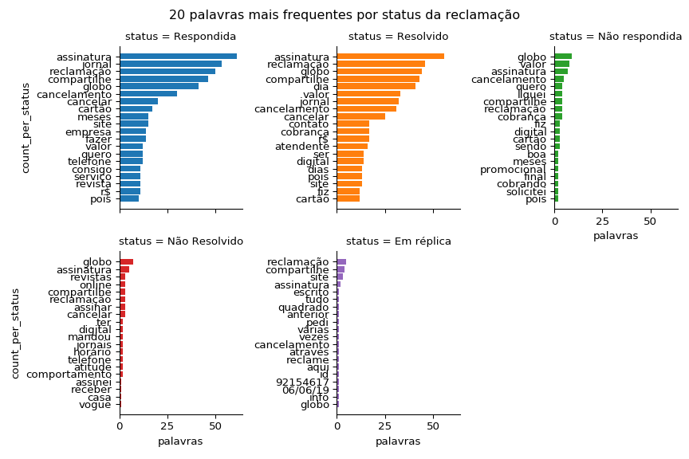
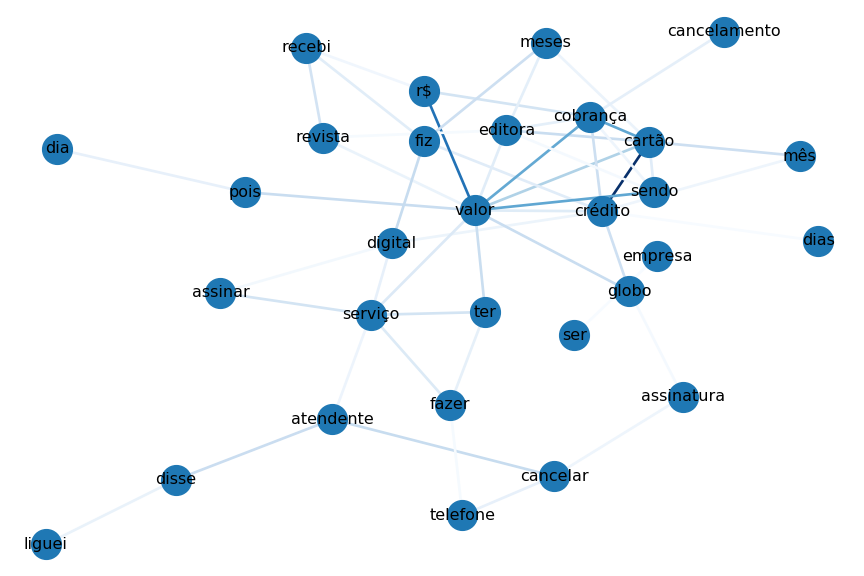
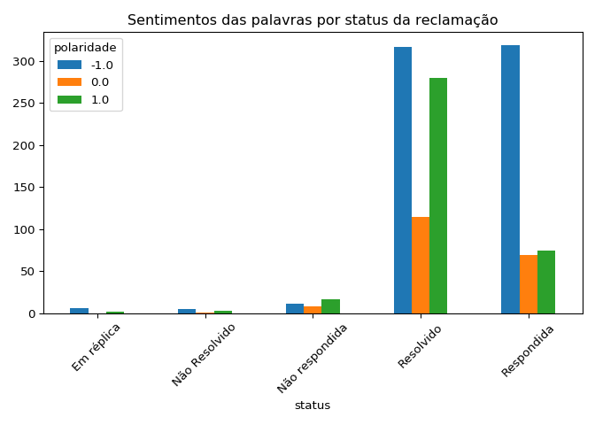
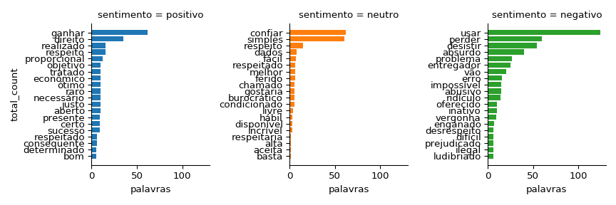

Automatizar a extração de informações de sites é provavelmente algo que
qualquer um que mexa com dados um dia vai se deparar. Para isso serve o
web scraping. Às vezes isso pode ser bastante trivial e às vezes não,
depende se o site carrega suas informações de maneira estática ou
dinâmica.

Na minha situação, foi o último caso. Eu precisava extrair
automaticamente indicadores das reclamações Reclame Aqui do mês atual,
mas no código-fonte da página não havia muito além de um código de
JavaScript, que só depois de rodado é que geraria as informações
interessantes. Ainda, você pode interagir para filtrar as informações
etc. Por isso, ele é dinâmico. Se fosse estático, todas as informações
pertinentes estariam estampadas no código-fonte.

Como não sabia quase nada sobre isso até então, não fazia ideia de como
resolver esse problema. Porém há um jeito que funciona muito bem, o
`Selenium`. Ele usa um navegador especial que pode ser controlado
remotamente, através do código, para interagir com as páginas dinâmicas.
O assim chamado *webdriver*. Eu utilizarei o do Firefox, o geckodriver.
Você precisará instalá-lo e se assegurar de que ele está em seu PATH.

Então, vamos utilizá-lo. O desafio aqui é fazer mineração de texto com
as descrições das últimas 100 reclamações para uma dada empresa. Para
isso, além do `selenium`, iremos usar o `BeautifulSoup`. Um serve mais
ao propósito de carregar o site e o outro mais ao de escavar o html.
Você pode instalá-los com `pip install selenium bs4`.

#### Script para a raspagem do site

Para crawlear as url's interessantes, criei uma classe que requer um
`webdriver` e uma string que identifica a empresa de interesse para
instanciá-la.

Ela tem dois métodos, o `ReclameAqui.extrair_informacoes()`, que, a cada
página, extrai informações sobre se o problema já resolvido, a cidade da
pessoa, há quanto tempo foi feita a reclamação, seu título e o link para
os detalhes.

Aqui entra o BeautifulSoup. Por exemplo, para extrair a informação do
título, precisamos inspecionar o HTML da página. Basta que você clique
no elemento de interesse com o botão direito do mouse e te aparecerá
essa opção. Uma tela vai surgir para que você identifique as tags do
elemento de HTML. Por exemplo, ele pode ser um "p" ou uma "div", e ter
uma "classe" ou um "id" etc.

Daí que, uma vez que você tenha transformado o código fonte em um objeto
do BeautifulSoup, ele vai conseguir facilmente extrair os elementos que
têm as características que você especificou com os métodos `find` ou
`find_all`.

O outro método da classe, o `extrair_descricoes`, crawleia o site com os
links extraídos com o método anterior. Ele vai de link em link extraindo
a descrição de cada reclamação.

Espero que o código tenha ficado claro, porque não conseguiria ser
sucinto o suficiente para explicá-lo sem me estender ainda mais.

``` python
from time import sleep
from selenium import webdriver
from bs4 import BeautifulSoup as bs


class ReclameAqui:

    base_url = "https://www.reclameaqui.com.br/empresa/"

    def __init__(self, driver, empresa):
        self.driver = driver
        self.empresa = empresa

    def extrair_informacoes(self, n_paginas):
        url = self.base_url + self.empresa + "/lista-reclamacoes/?pagina="
        self.reclamacoes, self.titulos, self.links = [], [], []

        for i in range(1, n_paginas + 1):
            self.driver.get(url + str(i))
            sleep(3)
            html = bs(self.driver.page_source, "html.parser")

            reclamacoes_html = html.find_all("p", {"class": "text-detail"})
            reclamacoes_na_pagina = [
                reclamacao.text.split("|") for reclamacao in reclamacoes_html
            ]
            self.reclamacoes.extend(reclamacoes_na_pagina)

            titulos_e_links = html.find_all(
                "a", {"class": "link-complain-id-complains"}
            )
            self.titulos.extend([titulo.text.strip() for titulo in titulos_e_links])
            self.links.extend([link.get("href") for link in titulos_e_links])

    def extrair_descricoes(self):
        urls = [self.base_url + link[1:] for link in self.links]
        self.descricoes = []
        for url in urls:
            self.driver.get(url)
            sleep(3)
            html = bs(self.driver.page_source, "html.parser")
            descricao = html.find("div", {"class": "complain-body"}).text.strip()
            self.descricoes.append(descricao)
```

Teoricamente, esse código funciona. Mas pela minha experiência, às vezes
o webdriver não chega nem a carregar a primeira página, o que me leva a
crer que há algum mecanismo de bloqueio no site, infelizmente. Daí que
poucas vezes eu consegui o output que eu desejaria, mas você pode
tentar.

De qualquer modo, ele é para ser utilizado como segue. Como faço estágio
lá, decidi extrair dados das reclamações da Infoglobo.

``` python
globo_url = "jornal-o-globo-infoglobo-jornal-extra-jornal-expresso"
globo = ReclameAqui(webdriver.Firefox(), globo_url)
# esses métodos extraem o status, título e link
# e há quanto tempo foi feita a reclamação,
# mais a cidade do reclamante.
# todas são armazenadas como atributos da classe:
globo.extrair_informacoes(10)  # 10 é o número das páginas
globo.extrair_descricoes()

# juntando tudo em um dataframe:

globo_df = pd.concat(
    [
        pd.DataFrame(globo.reclamacoes, columns=["status", "periodo", "cidade"]),
        pd.Series(globo.descricoes, name="descricao"),
        pd.Series(globo.titulos, name="titulo"),
    ],
    axis="columns",
)

# limpando os campos que vêm com espaços supérfluos dos lados
colunas_com_espaco = ["status", "periodo", "cidade"]
globo_df.loc[:, colunas_com_espaco] = df.loc[:, colunas_com_espaco].apply(
    lambda x: x.str.strip()
)
```

Uma vez que consegui a base que queria, de 100 reclamações, a salvei em
um csv, e é isto que irei explorar a partir daqui.

#### Análise exploratória de dados

``` python
import pandas as pd

globo_df = pd.read_csv("~/reclameaqui_globo.csv", index_col=0)

# printe todas as colunas
pd.set_option("display.max_columns", None)
globo_df.head()
```

    ##            status    periodo                cidade  \
    ## 0  Não respondida  Há 2 dias  Aparecida de Goiânia   
    ## 1       Resolvido  Há 4 dias               Niterói   
    ## 2       Resolvido  Há 5 dias        Rio de Janeiro   
    ## 3      Respondida  Há 5 dias           São Gonçalo   
    ## 4       Resolvido  Há 5 dias        Rio de Janeiro   
    ## 
    ##                                            descricao  \
    ## 0  Boa tarde, tem alguns meses que fiz uma assina...   
    ## 1  Fiz uma assinatura do O Globo em uma promoção ...   
    ## 2  Venho registrar a minha indignação com o sorte...   
    ## 3  A mais de 04 meses esta sendo lançado no meu c...   
    ## 4  Verifiquei na data de hoje, dia 13/08/2019, qu...   
    ## 
    ##                                               titulo  
    ## 0                        CANCELAR ASSINATURA DIGITAL  
    ## 1                 Pontos do Tudo Azul não creditados  
    ## 2  Descumprimento do regulamento da promoção Rock...  
    ## 3     COMPRA LANÇADA NO CARTÃO QUE NÃO SOU ASSINANTE  
    ## 4  Aumentaram para R$ 129,90 minha assinatura  e ...

Agora, vamos tentar fazer a mineração de texto no campo `descricao`, ao
estilo tidytext.

``` python
# vamos deixar tudo em minúsculo, tirar pontos e separar por espaço
# o que nos dará uma lista:
palavras = globo_df.descricao.str.lower().str.replace("[!?:;.,]", "").str.split()

palavras
```

    ## 0     [boa, tarde, tem, alguns, meses, que, fiz, uma...
    ## 1     [fiz, uma, assinatura, do, o, globo, em, uma, ...
    ## 2     [venho, registrar, a, minha, indignação, com, ...
    ## 3     [a, mais, de, 04, meses, esta, sendo, lançado,...
    ## 4     [verifiquei, na, data, de, hoje, dia, 13/08/20...
    ##                             ...                        
    ## 95    [tinha, uma, assinatura, que, cancelei, e, o, ...
    ## 96    [entro, no, meu, perfil, usando, o, facebook, ...
    ## 97    [manifestei, à, representante, do, jornal, o, ...
    ## 98    [depois, de, assinar, o, globo, digital, ao, v...
    ## 99    [já, pedi, que, minha, assinatura, do, o, glob...
    ## Name: descricao, Length: 100, dtype: object

``` python
# precisamos transformar cada item da lista em uma linha
# para obter o formato tidytext
# para isso, vamos utilizar um método do DataFrame, explode()
globo_df = globo_df.assign(palavras=palavras).explode("palavras")

globo_df.head()
```

    ##            status    periodo                cidade  \
    ## 0  Não respondida  Há 2 dias  Aparecida de Goiânia   
    ## 0  Não respondida  Há 2 dias  Aparecida de Goiânia   
    ## 0  Não respondida  Há 2 dias  Aparecida de Goiânia   
    ## 0  Não respondida  Há 2 dias  Aparecida de Goiânia   
    ## 0  Não respondida  Há 2 dias  Aparecida de Goiânia   
    ## 
    ##                                            descricao  \
    ## 0  Boa tarde, tem alguns meses que fiz uma assina...   
    ## 0  Boa tarde, tem alguns meses que fiz uma assina...   
    ## 0  Boa tarde, tem alguns meses que fiz uma assina...   
    ## 0  Boa tarde, tem alguns meses que fiz uma assina...   
    ## 0  Boa tarde, tem alguns meses que fiz uma assina...   
    ## 
    ##                         titulo palavras  
    ## 0  CANCELAR ASSINATURA DIGITAL      boa  
    ## 0  CANCELAR ASSINATURA DIGITAL    tarde  
    ## 0  CANCELAR ASSINATURA DIGITAL      tem  
    ## 0  CANCELAR ASSINATURA DIGITAL   alguns  
    ## 0  CANCELAR ASSINATURA DIGITAL    meses

Agora, podemos começar a fazer algumas visualizações. Para começar, pode
ser interessante ver as 20 palavras mais frequentes para cada "status".

``` python
import seaborn as sns
import matplotlib.pyplot as plt
from nltk.corpus import stopwords

globo_df = globo_df.query('palavras not in @stopwords.words("portuguese")')

globo_df["count_per_status"] = globo_df.groupby(
    ["palavras", "status"]
).palavras.transform("size")

fct = (
    globo_df.groupby(["status"], as_index=False)
    .apply(lambda x: x.drop_duplicates("palavras").nlargest(20, "count_per_status"))[
        ::-1
    ]
    .pipe((sns.FacetGrid, "data"), col="status", hue="status", sharey=False, col_wrap=3)
)

fct.map(plt.barh, "palavras", "count_per_status")
```

``` python
plt.subplots_adjust(top=0.9)
plt.suptitle("20 palavras mais frequentes por status da reclamação")

plt.show()
```



Vamos procurar visualizar também a correlação entre as palavras.

Infelizmente, não achei no Python um pacote como o `widyr` do R, mas
consegui fazer o mesmo no pandas. E é isso o que está sendo feito no
código abaixo. Ele está longe de ser *clean* mas foi o melhor que pude
fazer. Eu me assegurei que os dois jeitos me davam o mesmo resultado.

``` python
import networkx as nx

# criando tabela de correlações entre pares de palavras
# que aparecem no mínimo 15 vezes no total

correlations = (
    globo_df.palavras.reset_index()
    .assign(total_count=lambda x: x.groupby("palavras").palavras.transform("size"))
    .query("total_count >= 15")
    .drop(columns="total_count")
    .pivot_table(index="index", columns="palavras", aggfunc=lambda x: 1, fill_value=0)
    .corr()
    .unstack()
    .rename_axis(["item1", "item2"])
    .reset_index(name="correlation")
    .query("correlation != 1")
    .sort_values("correlation", ascending=False)
)

correlations.head(10)
```

    ##          item1     item2  correlation
    ## 210     cartão   crédito     0.736485
    ## 405    crédito    cartão     0.736485
    ## 1589     valor        r$     0.618257
    ## 1199        r$     valor     0.618257
    ## 1593     valor     sendo     0.521168
    ## 1359     sendo     valor     0.521168
    ## 206     cartão  cobrança     0.518751
    ## 245   cobrança    cartão     0.518751
    ## 279   cobrança     valor     0.515546
    ## 1566     valor  cobrança     0.515546

Para a visualização, vamos fazer um grafo das correlações com o pacote
`networkx`.

``` python
# criando grafo a partir do dataframe
G = nx.from_pandas_edgelist(correlations.head(100), "item1", "item2", "correlation")

# pesos dos vértices (no caso, as correlações)
weights = (
    pd.DataFrame(G.edges, columns=["item1", "item2"])
    .merge(correlations, on=["item1", "item2"])
    .correlation.values
)

# visualizar os nós e vértices separados
# de acordo com o algoritmo de Kamada & Kawai
nx.draw_kamada_kawai(
    G,
    with_labels=True,
    edge_color=weights,
    width=2,
    edge_cmap=plt.cm.Blues,
    node_size=500,
)

plt.show()
```



O que primeiro salta à vista é que quase todas as palavras estão
conectadas entre si. Não há "núcleos" que as separam nitidamente como
observamos no meu post sobre Game of Thrones.

De qualquer maneira, aqui aparece o que esperaríamos: entre as palavras
mais correlacionadas com "atendente" estão "cancelar", "disse",
"liguei". Entre outros mais óbvios do tipo "cartão" e "crédito",
"cancelamento" e "cobrança" etc.

Por fim, vamos tentar visualizar o sentimento médio das descrições por
status. Não encontrei um jeito fácil de fazer isso dentro do Python, até
porque há a complicação especial do texto estar em português.

Mas há uma solução, o
[SentiLex-PT](http://b2find.eudat.eu/dataset/b6bd16c2-a8ab-598f-be41-1e7aeecd60d3),
um léxico de sentimentos para o português. Você pode baixá-lo clicando
[aqui](http://dx.doi.org/doi:10.23728/b2share.93ab120efdaa4662baec6adee8e7585f).

No entanto, será preciso mais uma etapa de data cleaning. Eu usarei o
`SentiLex-flex-PT02.txt`, que cobre tanto flexão de gênero e número.
Nele, as linhas são registradas assim:

> aberração,aberração.PoS=N;FLEX=fs;TG=HUM:N0;POL:N0=-1;ANOT=MAN

O que nos interessa aqui são duas coisas: as palavras, separadas por
vírgulas, e a polaridade, que assume valores -1, 0 ou 1, identificada
após os caracteres "POL:N0=". É nesse sentido que irei criar uma regex
para extrair esses dois elementos.

``` python
# lendo o arquivo do lexicon
lexicon = pd.read_fwf("~/Downloads/SentiLex-PT02/SentiLex-flex-PT02.txt", header=None)

lexicon
```

    ##                                                        0
    ## 0      à-vontade,à-vontade.PoS=N;FLEX=ms;TG=HUM:N0;PO...
    ## 1      abafada,abafado.PoS=Adj;FLEX=fs;TG=HUM:N0;POL:...
    ## 2      abafadas,abafado.PoS=Adj;FLEX=fp;TG=HUM:N0;POL...
    ## 3      abafado,abafado.PoS=Adj;FLEX=ms;TG=HUM:N0;POL:...
    ## 4      abafados,abafado.PoS=Adj;FLEX=mp;TG=HUM:N0;POL...
    ## ...                                                  ...
    ## 82342  zotes,zote.PoS=Adj;FLEX=fp|mp;TG=HUM:N0;POL:N0...
    ## 82343  zumbidor,zumbidor.PoS=Adj;FLEX=ms;TG=HUM:N0;PO...
    ## 82344  zumbidora,zumbidor.PoS=Adj;FLEX=fs;TG=HUM:N0;P...
    ## 82345  zumbidoras,zumbidor.PoS=Adj;FLEX=fp;TG=HUM:N0;...
    ## 82346  zumbidores,zumbidor.PoS=Adj;FLEX=mp;TG=HUM:N0;...
    ## 
    ## [82347 rows x 1 columns]

``` python
# dando nome à coluna
lexicon.columns = ["palavras"]

# extraindo cada palavras e sua polaridade/sentimento
# o padrão ?P<X> serve para dar nome ao grupo
lexicon = lexicon.palavras.str.extract(
    r"(?P<palavras>[\w\-, ]+)\..*POL:N0=(?P<polaridade>-?\d)"
)
```

    ##                   palavras polaridade
    ## 0      à-vontade,à-vontade          1
    ## 1          abafada,abafado         -1
    ## 2         abafadas,abafado         -1
    ## 3          abafado,abafado         -1
    ## 4         abafados,abafado         -1
    ## ...                    ...        ...
    ## 82342           zotes,zote         -1
    ## 82343    zumbidor,zumbidor         -1
    ## 82344   zumbidora,zumbidor         -1
    ## 82345  zumbidoras,zumbidor         -1
    ## 82346  zumbidores,zumbidor         -1
    ## 
    ## [82347 rows x 2 columns]

``` python
# separando cada palavra
lexicon = lexicon.assign(palavras=lexicon.palavras.str.split(",")).explode("palavras")

lexicon.to_csv("Sentilex-PT-FLEX.csv")
```

    ##          palavras polaridade
    ## 0       à-vontade          1
    ## 0       à-vontade          1
    ## 1         abafada         -1
    ## 1         abafado         -1
    ## 2        abafadas         -1
    ## ...           ...        ...
    ## 82344    zumbidor         -1
    ## 82345  zumbidoras         -1
    ## 82345    zumbidor         -1
    ## 82346  zumbidores         -1
    ## 82346    zumbidor         -1
    ## 
    ## [161019 rows x 2 columns]

Agora, vamos fazer um left join com o data frame original e ver quantos
`np.nan` temos relativamente.

``` python
globo_palavras = globo_df.merge(lexicon, how="left", on="palavras")
globo_palavras.isna().mean()
```

    ## status              0.000000
    ## periodo             0.000000
    ## cidade              0.000000
    ## descricao           0.000000
    ## titulo              0.000000
    ## palavras            0.000000
    ## count_per_status    0.000000
    ## polaridade          0.801104
    ## dtype: float64

``` python
globo_palavras["polaridade"] = globo_palavras.polaridade.astype("float64")

(
    globo_palavras.groupby(["status", "polaridade"])
    .size()
    .unstack()
    .plot.bar(rot=45, title="Sentimentos das palavras por status da reclamação",)
)

plt.tight_layout()
plt.show()
```



Naturalmente, reclamações em geral são negativas, mas interessante que
as reclamações resolvidas em geral tem mais palavras positivas que as
outras.

Vamos ver quais são as palavras mais frequentes por
sentimento/polaridade.

``` python
import numpy as np

globo_palavras["sentimento"] = np.select(
    [
        globo_palavras.polaridade == 1,
        globo_palavras.polaridade == 0,
        globo_palavras.polaridade == -1,
    ],
    ["positivo", "neutro", "negativo"],
    default="ausente",
)

fct = (
    globo_palavras.query('sentimento != "ausente"')
    .assign(total_count=lambda x: x.groupby("palavras").palavras.transform("size"))
    .groupby("sentimento")[["palavras", "total_count"]]
    .apply(lambda x: x.drop_duplicates("palavras").nlargest(20, "total_count"))
    .reset_index()[::-1]
    .pipe((sns.FacetGrid, "data"), col="sentimento", hue="sentimento", sharey=False)
)
fct.map(plt.barh, "palavras", "total_count")

plt.show()
```



Aqui podemos conferir com mais detalhes a estrutura do léxico. As
palavras negativas estão coerentes com o que alguém que está reclamando
de um serviço em geral diria. Algumas palavras positivas deixariam de
assim assim o ser se postas em um contexto, provavelmente, mas isso faz
parte, e grande parte delas parece razoável. As neutras também parecem
bem classificadas.

Enfim, este post serve para ilustrar como podemos transformar dados na
web em visualizações com ferramentas de web scraping. A maior parte do
que mostrei aqui aprendi com a [Live de
Python](https://www.youtube.com/watch?v=MlzCElmtrxQ) do [Eduardo
Mendes](https://twitter.com/dunossauro), um dos melhores canais de
sempre. Devo muito do post a ele. Você também pode descobrir mais pela
documentação do [Selenium](https://selenium-python.readthedocs.io) e do
[BeautifulSoup](https://www.crummy.com/software/BeautifulSoup/bs4/doc/).
